# BVT2101 Iudin Artyom

This is web-site demo

Optional
```shell
fnm env --use-on-cd | Out-String | Invoke-Expression
```
Install dependecies
``` shell
yarn
```
And run
```shell
yarn dev
```
### Main
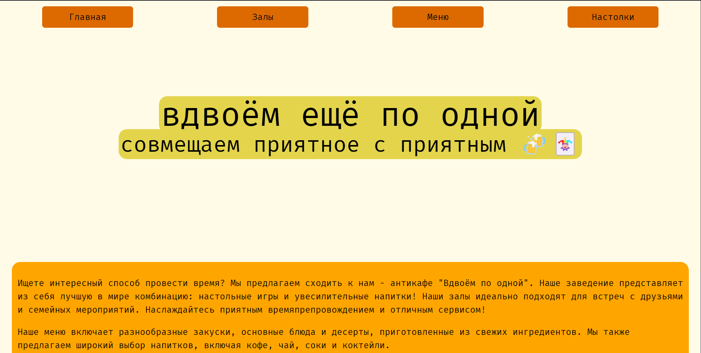
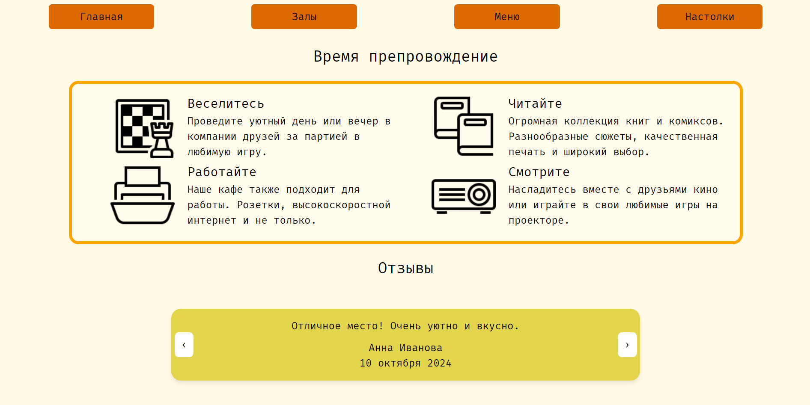
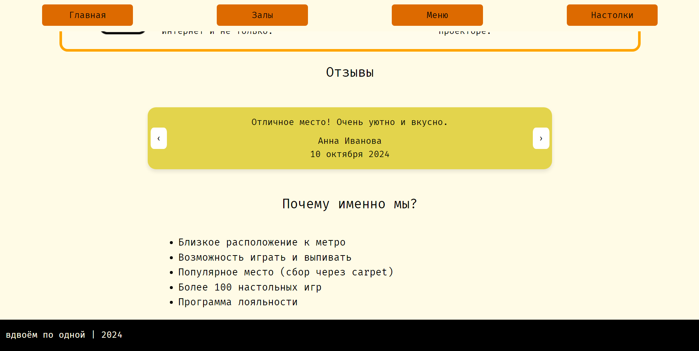

### Rooms
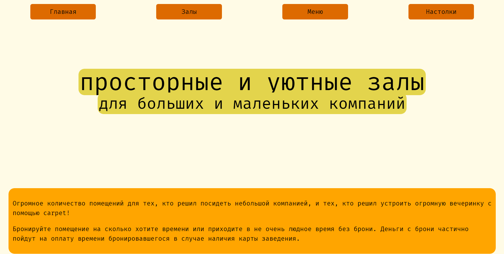
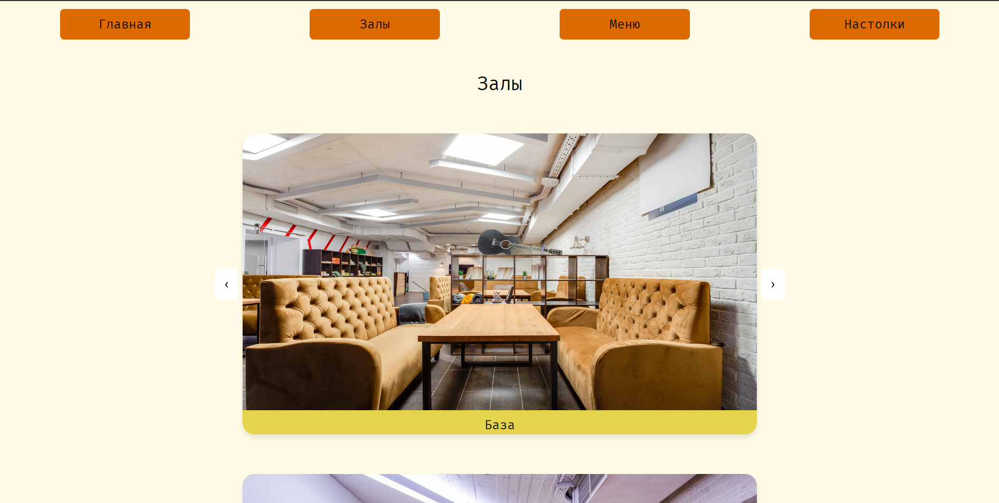
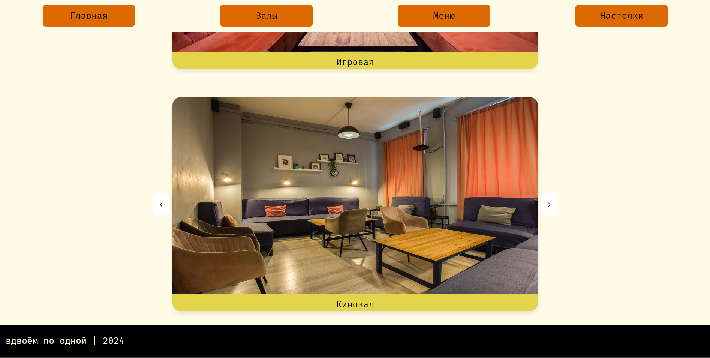

### Menu
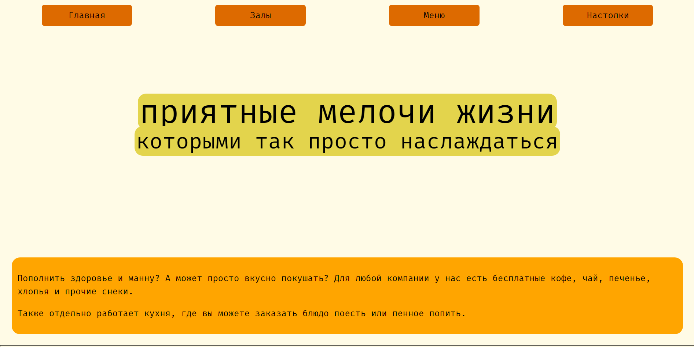
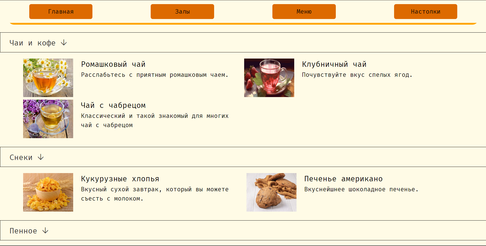
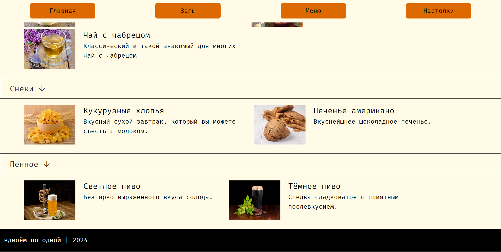

### Games
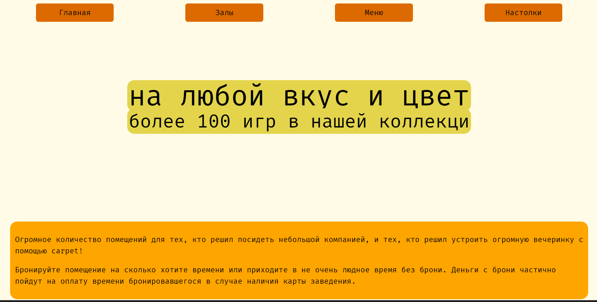
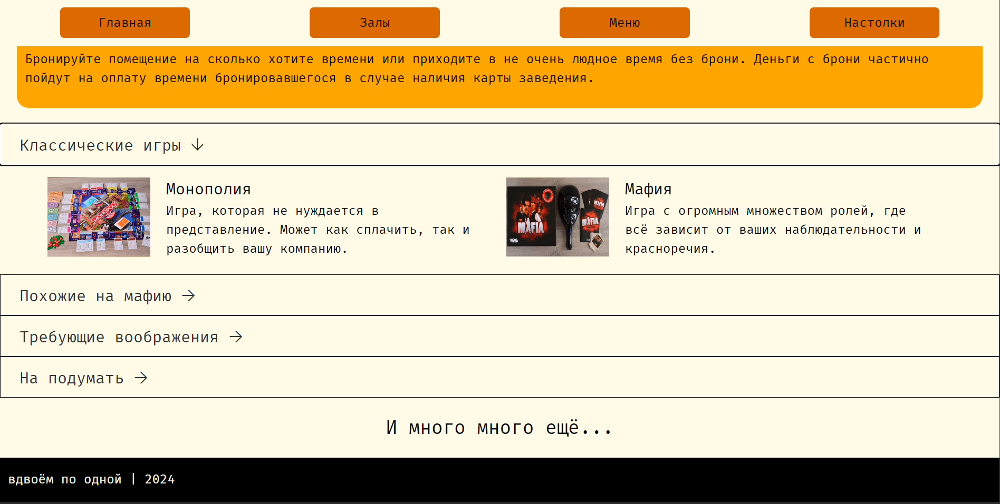